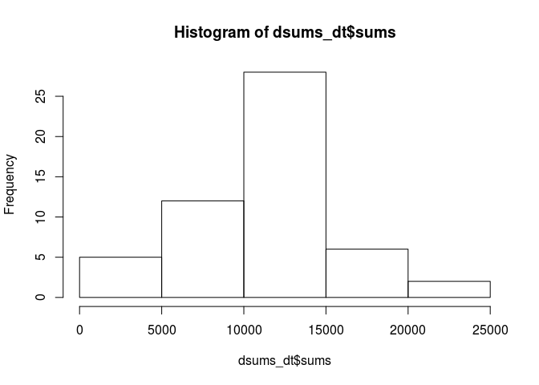
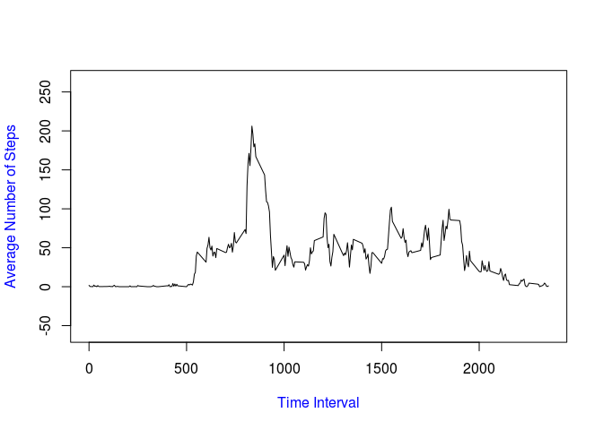
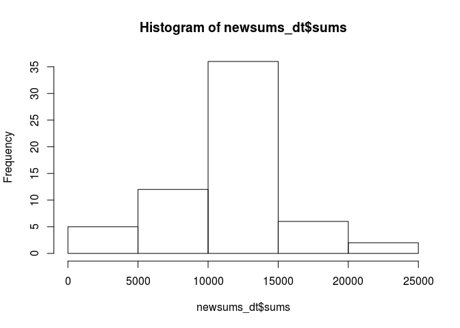
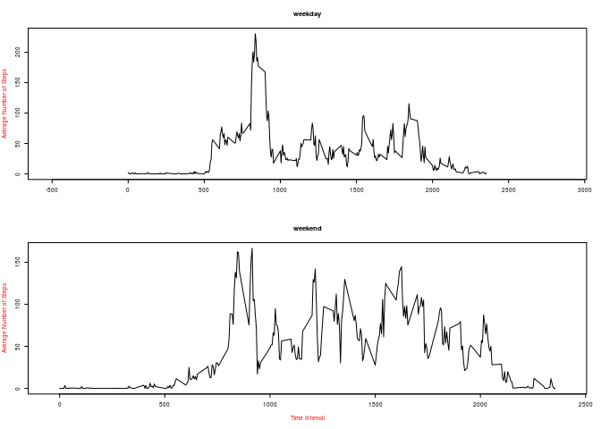

# Reproducible Research: Peer Assessment 1
Phillip Hardwick  


## Loading and preprocessing the data

```r
reprorepo <- read.csv("activity.csv")
uni_d <- unique(reprorepo$date)

dsums_dt <- data.frame(uni_d)
for(i in 1:length(dsums_dt$uni_d)){
  dsums_dt$sums[i] <- sum(reprorepo$steps[which(reprorepo$date==dsums_dt$uni_d[i])])
  dsums_dt$median[i] <- median(reprorepo$steps[which(reprorepo$date==dsums_dt$uni_d[i])])
  dsums_dt$mean[i] <- mean(reprorepo$steps[which(reprorepo$date==dsums_dt$uni_d[i])])
}
```


## histogram of the total number of steps taken each day


```r
hist(dsums_dt$sums)
```

<!-- -->


## Median, Mean, and Sum Values per Day

```r
dsums_dt
```

```
##         uni_d  sums median       mean
## 1  2012-10-01    NA     NA         NA
## 2  2012-10-02   126      0  0.4375000
## 3  2012-10-03 11352      0 39.4166667
## 4  2012-10-04 12116      0 42.0694444
## 5  2012-10-05 13294      0 46.1597222
## 6  2012-10-06 15420      0 53.5416667
## 7  2012-10-07 11015      0 38.2465278
## 8  2012-10-08    NA     NA         NA
## 9  2012-10-09 12811      0 44.4826389
## 10 2012-10-10  9900      0 34.3750000
## 11 2012-10-11 10304      0 35.7777778
## 12 2012-10-12 17382      0 60.3541667
## 13 2012-10-13 12426      0 43.1458333
## 14 2012-10-14 15098      0 52.4236111
## 15 2012-10-15 10139      0 35.2048611
## 16 2012-10-16 15084      0 52.3750000
## 17 2012-10-17 13452      0 46.7083333
## 18 2012-10-18 10056      0 34.9166667
## 19 2012-10-19 11829      0 41.0729167
## 20 2012-10-20 10395      0 36.0937500
## 21 2012-10-21  8821      0 30.6284722
## 22 2012-10-22 13460      0 46.7361111
## 23 2012-10-23  8918      0 30.9652778
## 24 2012-10-24  8355      0 29.0104167
## 25 2012-10-25  2492      0  8.6527778
## 26 2012-10-26  6778      0 23.5347222
## 27 2012-10-27 10119      0 35.1354167
## 28 2012-10-28 11458      0 39.7847222
## 29 2012-10-29  5018      0 17.4236111
## 30 2012-10-30  9819      0 34.0937500
## 31 2012-10-31 15414      0 53.5208333
## 32 2012-11-01    NA     NA         NA
## 33 2012-11-02 10600      0 36.8055556
## 34 2012-11-03 10571      0 36.7048611
## 35 2012-11-04    NA     NA         NA
## 36 2012-11-05 10439      0 36.2465278
## 37 2012-11-06  8334      0 28.9375000
## 38 2012-11-07 12883      0 44.7326389
## 39 2012-11-08  3219      0 11.1770833
## 40 2012-11-09    NA     NA         NA
## 41 2012-11-10    NA     NA         NA
## 42 2012-11-11 12608      0 43.7777778
## 43 2012-11-12 10765      0 37.3784722
## 44 2012-11-13  7336      0 25.4722222
## 45 2012-11-14    NA     NA         NA
## 46 2012-11-15    41      0  0.1423611
## 47 2012-11-16  5441      0 18.8923611
## 48 2012-11-17 14339      0 49.7881944
## 49 2012-11-18 15110      0 52.4652778
## 50 2012-11-19  8841      0 30.6979167
## 51 2012-11-20  4472      0 15.5277778
## 52 2012-11-21 12787      0 44.3993056
## 53 2012-11-22 20427      0 70.9270833
## 54 2012-11-23 21194      0 73.5902778
## 55 2012-11-24 14478      0 50.2708333
## 56 2012-11-25 11834      0 41.0902778
## 57 2012-11-26 11162      0 38.7569444
## 58 2012-11-27 13646      0 47.3819444
## 59 2012-11-28 10183      0 35.3576389
## 60 2012-11-29  7047      0 24.4687500
## 61 2012-11-30    NA     NA         NA
```


```r
repro_interval_dt <- data.frame(int = unique(reprorepo$interval))
for(i in 1: length(repro_interval_dt$int)){
  repro_interval_dt$int_mean[i] <- mean(reprorepo$steps[which(reprorepo$interval==repro_interval_dt$int[i])],na.rm = TRUE)
}
```


## What is mean total number of steps taken per day?

## Average number of steps taken averaged across all days


```r
plot(repro_interval_dt$int_mean~repro_interval_dt$int,type="l",ylab="Average Number of Steps",xlab="Time Interval", asp=4,col.lab = "blue",cex=1)
```

<!-- -->


## Interval with highest number of steps

```r
repro_interval_dt$int[which(repro_interval_dt$int_mean == max(repro_interval_dt$int_mean))]
```

```
## [1] 835
```


## What is the average daily activity pattern?


## Imputing missing values

## Number of NA values in dataset

```r
  sum(is.na(reprorepo$steps))
```

```
## [1] 2304
```

## Missing values filled in by using mean data per interval, new copy of dataset created, mean and median calculated

```r
reprorepo_copy <- reprorepo
reprorepo_copy$steps <- with(reprorepo, ave(steps, interval,FUN = function(x) replace(x, is.na(x), mean(x, na.rm = TRUE))))
newsums_dt <- data.frame(uni_d)
for(i in 1:length(newsums_dt$uni_d)){
  newsums_dt$sums[i] <- sum(reprorepo_copy$steps[which(reprorepo_copy$date==newsums_dt$uni_d[i])])
  newsums_dt$median[i] <- median(reprorepo_copy$steps[which(reprorepo_copy$date==newsums_dt$uni_d[i])])
  newsums_dt$mean[i] <- mean(reprorepo_copy$steps[which(reprorepo_copy$date==newsums_dt$uni_d[i])])
}
```

## Mean and median values 


```r
  newsums_dt
```

```
##         uni_d     sums   median       mean
## 1  2012-10-01 10766.19 34.11321 37.3825996
## 2  2012-10-02   126.00  0.00000  0.4375000
## 3  2012-10-03 11352.00  0.00000 39.4166667
## 4  2012-10-04 12116.00  0.00000 42.0694444
## 5  2012-10-05 13294.00  0.00000 46.1597222
## 6  2012-10-06 15420.00  0.00000 53.5416667
## 7  2012-10-07 11015.00  0.00000 38.2465278
## 8  2012-10-08 10766.19 34.11321 37.3825996
## 9  2012-10-09 12811.00  0.00000 44.4826389
## 10 2012-10-10  9900.00  0.00000 34.3750000
## 11 2012-10-11 10304.00  0.00000 35.7777778
## 12 2012-10-12 17382.00  0.00000 60.3541667
## 13 2012-10-13 12426.00  0.00000 43.1458333
## 14 2012-10-14 15098.00  0.00000 52.4236111
## 15 2012-10-15 10139.00  0.00000 35.2048611
## 16 2012-10-16 15084.00  0.00000 52.3750000
## 17 2012-10-17 13452.00  0.00000 46.7083333
## 18 2012-10-18 10056.00  0.00000 34.9166667
## 19 2012-10-19 11829.00  0.00000 41.0729167
## 20 2012-10-20 10395.00  0.00000 36.0937500
## 21 2012-10-21  8821.00  0.00000 30.6284722
## 22 2012-10-22 13460.00  0.00000 46.7361111
## 23 2012-10-23  8918.00  0.00000 30.9652778
## 24 2012-10-24  8355.00  0.00000 29.0104167
## 25 2012-10-25  2492.00  0.00000  8.6527778
## 26 2012-10-26  6778.00  0.00000 23.5347222
## 27 2012-10-27 10119.00  0.00000 35.1354167
## 28 2012-10-28 11458.00  0.00000 39.7847222
## 29 2012-10-29  5018.00  0.00000 17.4236111
## 30 2012-10-30  9819.00  0.00000 34.0937500
## 31 2012-10-31 15414.00  0.00000 53.5208333
## 32 2012-11-01 10766.19 34.11321 37.3825996
## 33 2012-11-02 10600.00  0.00000 36.8055556
## 34 2012-11-03 10571.00  0.00000 36.7048611
## 35 2012-11-04 10766.19 34.11321 37.3825996
## 36 2012-11-05 10439.00  0.00000 36.2465278
## 37 2012-11-06  8334.00  0.00000 28.9375000
## 38 2012-11-07 12883.00  0.00000 44.7326389
## 39 2012-11-08  3219.00  0.00000 11.1770833
## 40 2012-11-09 10766.19 34.11321 37.3825996
## 41 2012-11-10 10766.19 34.11321 37.3825996
## 42 2012-11-11 12608.00  0.00000 43.7777778
## 43 2012-11-12 10765.00  0.00000 37.3784722
## 44 2012-11-13  7336.00  0.00000 25.4722222
## 45 2012-11-14 10766.19 34.11321 37.3825996
## 46 2012-11-15    41.00  0.00000  0.1423611
## 47 2012-11-16  5441.00  0.00000 18.8923611
## 48 2012-11-17 14339.00  0.00000 49.7881944
## 49 2012-11-18 15110.00  0.00000 52.4652778
## 50 2012-11-19  8841.00  0.00000 30.6979167
## 51 2012-11-20  4472.00  0.00000 15.5277778
## 52 2012-11-21 12787.00  0.00000 44.3993056
## 53 2012-11-22 20427.00  0.00000 70.9270833
## 54 2012-11-23 21194.00  0.00000 73.5902778
## 55 2012-11-24 14478.00  0.00000 50.2708333
## 56 2012-11-25 11834.00  0.00000 41.0902778
## 57 2012-11-26 11162.00  0.00000 38.7569444
## 58 2012-11-27 13646.00  0.00000 47.3819444
## 59 2012-11-28 10183.00  0.00000 35.3576389
## 60 2012-11-29  7047.00  0.00000 24.4687500
## 61 2012-11-30 10766.19 34.11321 37.3825996
```

## Histogram of data with NA data replaced

```r
  hist(newsums_dt$sums)
```

<!-- -->

## Are there differences in activity patterns between weekdays and weekends?

## Derive day of week from Date and assign factor of either weekend or weekday

```r
  reprorepo_copy$date <- as.Date(reprorepo_copy$date,"%Y-%m-%d")
weekend_days <- c("Saturday","Sunday")
reprorepo_copy$part_of_week <- factor((weekdays(reprorepo_copy$date) %in% weekend_days), levels=c(FALSE, TRUE), labels=c('weekday', 'weekend'))
repro_nona_weekend <- data.frame(int = unique(reprorepo_copy$interval))   
repro_nona_weekday <- data.frame(int = unique(reprorepo_copy$interval))
for(i in 1: length(repro_nona_weekend$int)){
  repro_nona_weekend$int_mean[i] <-mean(reprorepo_copy$steps[which(reprorepo_copy$part_of_week == 'weekend' & reprorepo_copy$interval == repro_nona_weekend$int[i])])

}
for(i in 1: length(repro_nona_weekday$int)){
  repro_nona_weekday$int_mean[i] <-mean(reprorepo_copy$steps[which(reprorepo_copy$part_of_week == 'weekday' & reprorepo_copy$interval == repro_nona_weekday$int[i])])
  
}
```

## Plot comparing weekend and weekday activity

```r
par(mfrow = c(2, 1))
par(cex = .4)
par(col.lab = "red")
plot(repro_nona_weekday$int_mean~repro_nona_weekday$int,type="l",main = "weekday",ylab="Average Number of Steps",xlab = "",asp = 4)
plot(repro_nona_weekend$int_mean~repro_nona_weekend$int,type="l",main = "weekend",ylab="Average Number of Steps",xlab="Time Interval", asp = 4)
```

<!-- -->
